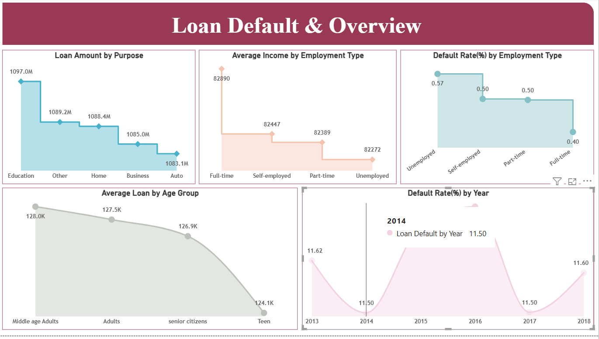
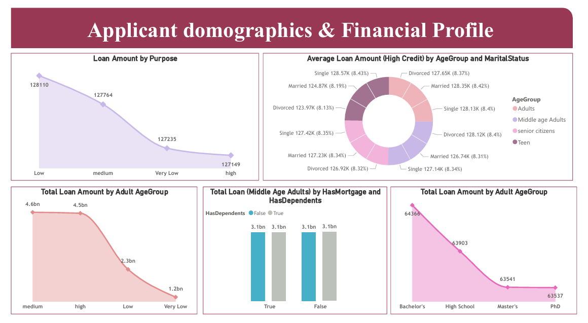
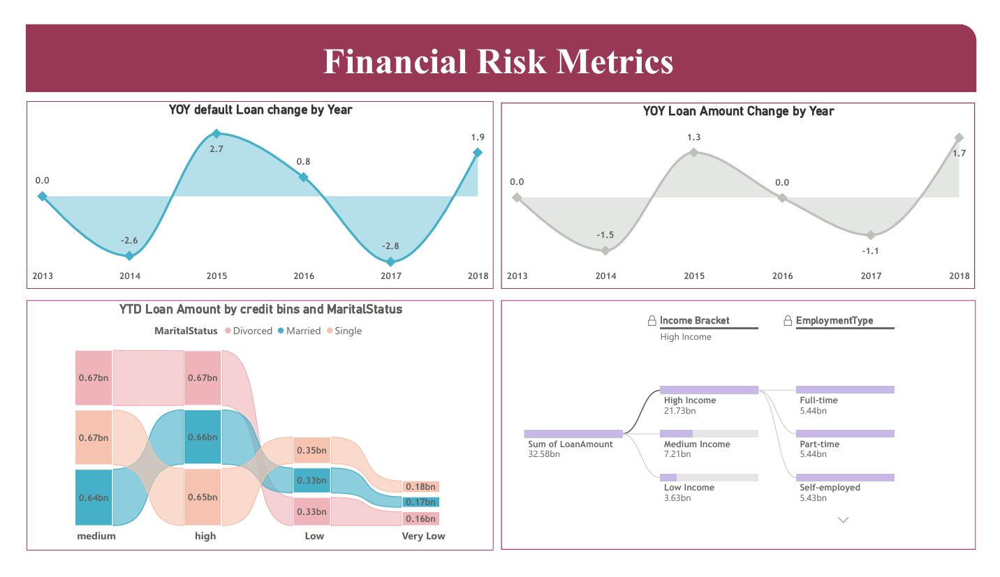

#  Loan Default Risk Analysis (Power BI + SQL)



##  Project Overview

This project analyzes **loan default patterns** using **Power BI, SQL Server, and DAX** to understand how borrower demographics, financial attributes, and loan characteristics influence **loan default risk**.

The dataset contains approximately **250,000 loan records**, and the analysis focuses on identifying patterns in **income levels, employment types, credit scores, loan purposes, and borrower demographics**.

The final result is an **interactive Power BI dashboard** that helps visualize borrower behavior and financial risk metrics.

---

#  Project Objectives

• Analyze borrower financial profiles
• Understand loan distribution across demographics
• Identify factors influencing loan default risk
• Build interactive dashboards for financial insights

---

#  Dataset Information

The dataset contains the following attributes:

LoanID
Age
Income
LoanAmount
CreditScore
MonthsEmployed
NumCreditLines
InterestRate
LoanTerm
DTIRatio
Education
EmploymentType
MaritalStatus
HasMortgage
HasDependents
LoanPurpose
HasCoSigner
Default
Loan Date (DD/MM/YYYY)

Dataset Size: **~250,000 records**

---

#  Data Pipeline

### 1️⃣ Data Storage

• Imported CSV dataset into **SQL Server database**
• Created database named **loan**

### 2️⃣ Data Connection

• Connected **SQL Server → Power BI**

### 3️⃣ Data Preparation

Performed inside **Power Query Editor**

• Data profiling of entire dataset
• Verified **no missing or error values**
• Corrected **column data types**

### 4️⃣ Data Modeling

Created calculated column:

```
Year = YEAR(loan_default[Loan_Date])
```

### 5️⃣ DAX Measures

Created several analytical measures to support dashboard insights.

---

# 📈 Key DAX Measures

### Loan Amount by Purpose

```
Loan Amount by Purpose =
SUMX(
    FILTER(
        'loan_default',
        NOT(ISBLANK('loan_default'[LoanAmount]))
    ),
    'loan_default'[LoanAmount]
)
```

---

### Average Income by Employment Type

```
Average Income by Employment Type =
CALCULATE(
    AVERAGE('loan_default'[Income]),
    ALLEXCEPT('loan_default','loan_default'[EmploymentType])
)
```

---

### Default Rate by Employment Type

Used the following functions:

COUNTROWS
FILTER
CALCULATE
ALLEXCEPT
DIVIDE

To compute **default rate percentage for each employment category**.

---

### Average Loan by Age Group

Functions used:

VALUES
AVERAGEX

Calculates **average loan amount for each age group**.

---

### Default Rate by Year

Logic used:

COUNTROWS → total loans
FILTER → default loans
ALLEXCEPT → maintain year filter
DIVIDE → safe division

Used to calculate **yearly loan default rate**.

---

### Median Loan Amount

```
Median Loan Amount =
MEDIANX('loan_default','loan_default'[LoanAmount])
```

Used to analyze **loan distribution across credit score bins**.

---

#  Dashboard Preview

## Loan Default Overview


## Applicant Demographics



## Financial Risk Metrics



---

#  Dashboard Pages

### 1️⃣ Loan Default & Overview

Visualizations include:

• Loan Amount by Purpose
• Average Income by Employment Type
• Default Rate by Employment Type
• Average Loan by Age Group
• Default Rate by Year

---

### 2️⃣ Applicant Demographics & Financial Profile

Visualizations include:

• Loan Amount by Income Brackets
• Loan Distribution by Age Group
• Loan Distribution by Education
• Mortgage & Dependents Analysis
• Marital Status and Credit Score Insights

---

### 3️⃣ Financial Risk Metrics

Visualizations include:

• Year-over-Year Default Change
• Year-over-Year Loan Amount Change
• Loan Amount by Credit Score Bins
• Income vs Employment Loan Distribution

---

# 🛠 Tools & Technologies

Power BI
SQL Server
DAX
Power Query
Excel

---

#  Skills Demonstrated

• Data Cleaning
• Data Profiling
• Data Modeling
• DAX Calculations
• Financial Data Analysis
• Data Visualization
• Dashboard Design

---

#  Project Structure

```
loan-default-analysis-powerbi
│
├── Loan_Default_Dashboard.pbix
├── loan_dataset.csv
├── powerbi_dashboard.pdf
├── screenshots
│   ├── dashboard_overview.png
│   ├── demographics.png
│   └── financial_risk.png
└── README.md
```

---

# 🚀 Future Improvements

• Build **machine learning model to predict loan default risk**
• Deploy dashboard on **Power BI Service**
• Add **predictive analytics and financial risk scoring**

---

# 👨‍💻 Author

**Himanchal mishra**
Engineering Student | Data Analytics Enthusiast

Skills:
Power BI | SQL | DAX | Data Analytics | Data Visualization
